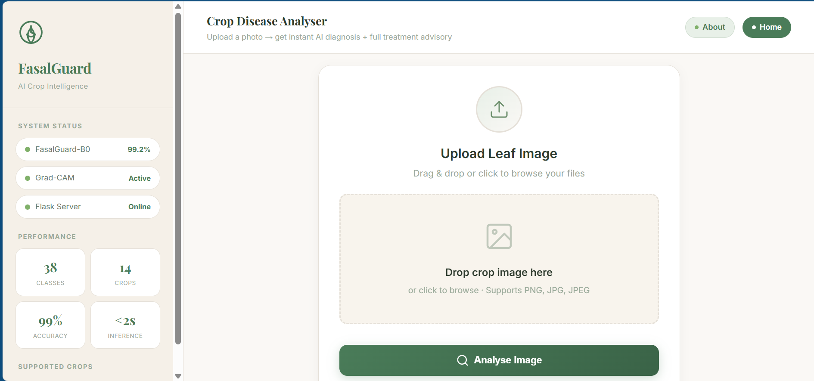
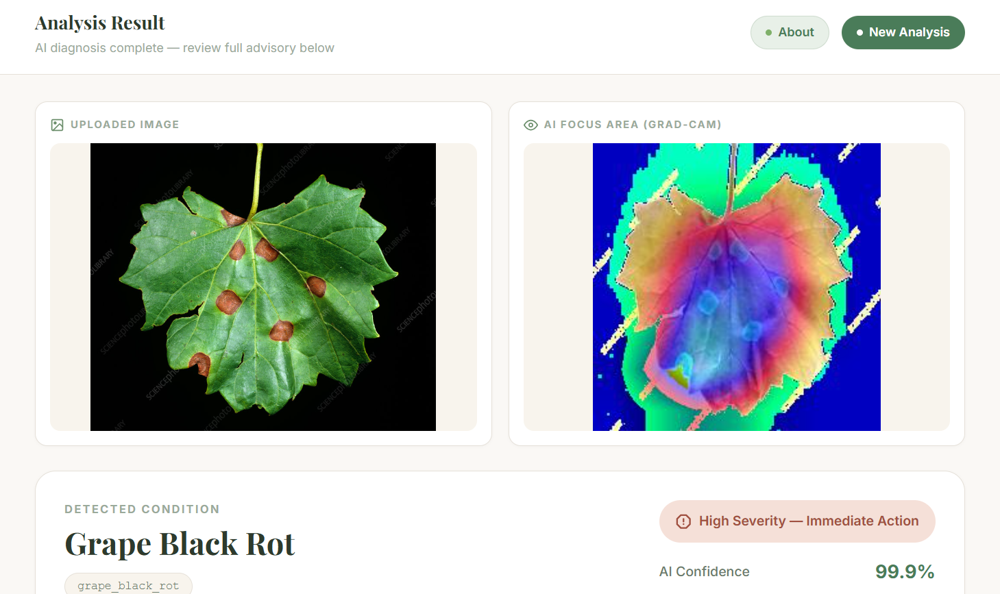

# FasalGuard AI

> AI-powered crop disease detection for farmers — upload a leaf photo, get instant diagnosis, severity rating, and treatment advice.

## What It Does

FasalGuard AI is a web application that helps farmers and agricultural students identify crop diseases from a single leaf photograph. A user uploads an image, and a deep learning model (EfficientNet-B0) classifies it into one of 38 possible conditions across 14 crop types. The app returns the disease name, a confidence score, a severity estimate, a Grad-CAM heatmap showing where the AI focused, and step-by-step treatment recommendations including chemical names and dosages.

## Screenshots

| Upload Page | Result Page |
|---|---|
|  |  |

> Place your screenshots in a `docs/` folder and update the paths above.

## Tech Stack

| Component | Technology |
|---|---|
| Deep Learning Model | EfficientNet-B0 (PyTorch) |
| Heatmap Visualisation | Grad-CAM |
| Web Backend | Flask (Python) |
| Frontend | HTML5 + CSS3 |
| Dataset | PlantVillage (38 classes, 53,000+ images) |

## Setup & Run Instructions

### 1. Clone the Repository

```bash
git clone https://github.com/ThinkAboutArif/fasalguard-ai.git
cd fasalguard-ai
```

### 2. Create a Virtual Environment

```bash
python -m venv fasalguard_env
```

### 3. Activate the Environment

**Windows:**
```bash
fasalguard_env\Scripts\activate
```

**macOS / Linux:**
```bash
source fasalguard_env/bin/activate
```

### 4. Install Dependencies

```bash
pip install -r requirements_laptop.txt
```

> **Note:** PyTorch will install the CPU version automatically. If you have a CUDA GPU, install the GPU version manually from [pytorch.org](https://pytorch.org).

### 5. Add the Trained Model

Download the trained model file `fasalguard_model.pt` and place it in:
```
app/model/fasalguard_model.pt
```

Also place `class_names.json` in:
```
app/model/class_names.json
```

> The model is not included in the repository due to file size. Contact the author or train your own using `training/train.py`.

### 6. Run the App

```bash
cd app
python app.py
```

### 7. Open in Browser

Go to: [http://localhost:5000](http://localhost:5000)

---

## 38 Detectable Diseases & Conditions

### Apple (4)
- Apple Scab
- Apple Black Rot
- Apple Cedar Rust
- Healthy Apple

### Blueberry (1)
- Healthy Blueberry

### Cherry (2)
- Healthy Cherry
- Cherry Powdery Mildew

### Maize / Corn (4)
- Maize Gray Leaf Spot (Cercospora)
- Maize Common Rust
- Healthy Maize
- Maize Northern Leaf Blight

### Grape (4)
- Grape Black Rot
- Grape Esca (Black Measles)
- Healthy Grape
- Grape Leaf Blight

### Orange (1)
- Citrus Greening (Huanglongbing)

### Peach (2)
- Peach Bacterial Spot
- Healthy Peach

### Pepper (2)
- Pepper Bacterial Spot
- Healthy Bell Pepper

### Potato (3)
- Potato Early Blight
- Healthy Potato
- Potato Late Blight

### Raspberry (1)
- Healthy Raspberry

### Soybean (1)
- Healthy Soybean

### Squash (1)
- Squash Powdery Mildew

### Strawberry (2)
- Healthy Strawberry
- Strawberry Leaf Scorch

### Tomato (10)
- Tomato Bacterial Spot
- Tomato Early Blight
- Healthy Tomato
- Tomato Late Blight
- Tomato Leaf Mold
- Tomato Septoria Leaf Spot
- Tomato Spider Mite (Two-Spotted)
- Tomato Target Spot
- Tomato Mosaic Virus
- Tomato Yellow Leaf Curl Virus

---

## Model Performance

| Metric | Value |
|---|---|
| Validation Accuracy | 99.17% |
| Test Accuracy | 99.27% |
| Training Epochs | 5 |
| Dataset | PlantVillage (53,114 images after cleaning) |
| Classes | 38 |

---

## Project Structure

```
fasalguard/
├── app/
│   ├── app.py                  # Flask server
│   ├── model/
│   │   ├── fasalguard_model.pt # Trained model (not in repo)
│   │   └── class_names.json    # Class label mapping
│   ├── templates/
│   │   ├── index.html          # Upload page
│   │   ├── result.html         # Results page
│   │   └── about.html          # About page
│   └── static/
│       └── style.css           # App styling
├── training/
│   ├── train.py                # Training script
│   └── class_names.json        # Class names for training
├── scripts/
│   ├── organise_data.py        # Dataset organisation
│   ├── clean_data.py           # Data cleaning
│   ├── check_balance.py        # Class balance check
│   └── split_data.py           # Train/val/test split
├── requirements_laptop.txt     # Laptop dependencies
├── requirements_gpu.txt        # GPU training dependencies
└── README.md                   # This file
```

---

## Author

**Arif**  
Fourth Semester Student  
CECOS University, Peshawar, Pakistan

---

## License

This project was built for academic purposes as part of a university semester project.

## Acknowledgements

- [PlantVillage Dataset](https://github.com/spMohanty/PlantVillage-Dataset) — open-source crop disease image dataset
- [PyTorch](https://pytorch.org/) — deep learning framework
- [Flask](https://flask.palletsprojects.com/) — web micro-framework
- [pytorch-grad-cam](https://github.com/jacobgil/pytorch-grad-cam) — Grad-CAM implementation
